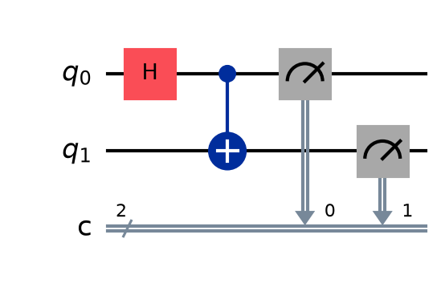
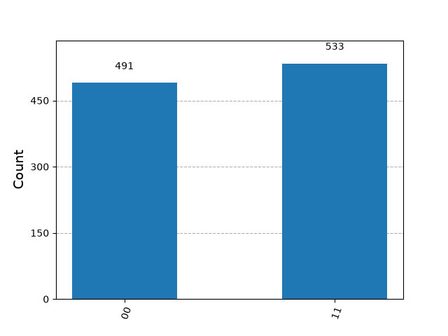

Quantum Entanglement with Qiskit

A simple quantum computing project built with Qiskit to demonstrate two fundamental concepts in quantum computing: superposition and quantum entanglement.

Overview

This project creates a 2-qubit quantum circuit that generates a Bell state.

The circuit:

1. Applies a Hadamard gate (H) to the first qubit to create superposition.
2. Applies a CNOT gate (CX) to entangle the two qubits.
3. Measures both qubits.
4. Runs the circuit using Qiskit Aer Simulator.
5. Visualizes the circuit and measurement results.

Quantum Circuit

The circuit follows this structure:

q₀ ── H ──●──── M
          │
q₁ ───────X──── M

The Hadamard gate creates superposition, while the CNOT gate creates entanglement between the two qubits.

Results

After running the circuit multiple times, the measurement results are concentrated around:

00 ≈ 50%
11 ≈ 50%

while 01 and 10 should occur rarely or not at all.

Circuit Diagram

Measurement Results

Technologies

* Python
* Qiskit
* Qiskit Aer
* Matplotlib

What I Learned

Through this project, I explored how quantum gates can be combined to create quantum states and how quantum measurement produces probabilistic results.

This project is part of my journey into Quantum Computing, Artificial Intelligence, and Quantum AI.

Future Improvements

* Run the circuit on a real quantum computer.
* Experiment with different quantum gates.
* Build and analyze other Bell states.
* Explore quantum algorithms using Qiskit.

Author

Alina Abandeh

Computer Science Student interested in Quantum Computing, Artificial Intelligence, and Quantum AI.

